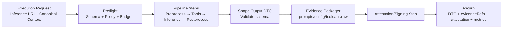
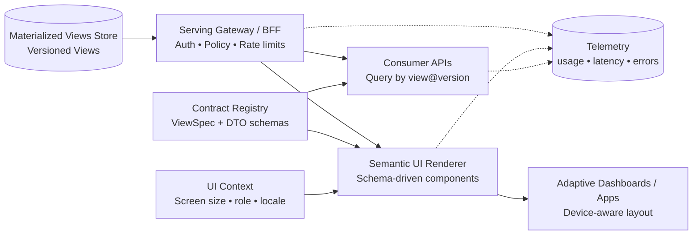

### Diagram 1 — Full System Architecture (All systems)

```mermaid
flowchart LR
  subgraph EDGE[Edge & Producers]
    A1[Web / Mobile UI]
    A2[Backend Services]
    A3[Batch Jobs / ETL]
    A4[3rd-party Integrations]
  end

  subgraph CONTRACTS[Contracts, Identity, Security]
    B1[Schema / Contract Registry<br/>Events • DTOs • ViewSpecs • StackSpecs]
    B2[Correlation IDs / ULIDs]
    B3[Encryption / Key Management]
    B4[Policy & Governance<br/>PII • retention • access]
  end

  subgraph BACKBONE[Event Backbone & Telemetry]
    C1[(Event Log / Message Bus)]
    C2[(Telemetry Store<br/>Logs • Metrics • Traces)]
  end

  subgraph DET[Deterministic Compute]
    D1[Stream Processing<br/>Filter • Enrich • Aggregate]
    D2[Workflow / State Machine Engine<br/>Long-running state]
    D3[Deterministic View Builder<br/>DTO/DAO transforms + policies]
    D4[(State Store)]
    D5[(Materialized Views Store)]
  end

  subgraph INF[Inference Plane (Agnostic)]
    E1[Inference Decision Gate]
    E2[Inference URI Builder<br/>viewSpec + stackSpec + contextHash]
    E3[Resolver<br/>Policy • Budget • Cache • Routing]
    E4[(Result Cache)]
    E5[Pluggable Runtime(s)<br/>LLM • ML • Rules • Tools]
    E6[Receipt Generator<br/>Hashes + Evidence + Attestation]
    E7[(Append-only Audit Log)]
    E8[(Evidence Store)]
  end

  subgraph SERVE[Serving]
    F1[API Gateway / BFF]
    F2[Semantic UI Renderer<br/>Schema-driven]
    F3[Dashboards / Apps]
    F4[Downstream Consumers]
  end

  A1 --> B2 --> B1 --> B3 --> C1
  A2 --> B2
  A3 --> B2
  A4 --> B2
  B4 --> C1

  C1 --> D1 --> D4
  C1 --> D2 --> D4
  D4 --> D3 --> D5

  D3 --> E1
  E1 -->|Derivable| D5
  E1 -->|Needs inference| E2 --> E3
  E3 -->|Cache hit| E4 --> D5
  E3 -->|Cache miss| E5 --> E6 --> E4
  E6 --> E7
  E6 --> E8
  E4 --> D5

  D5 --> F1 --> F2 --> F3
  F1 --> F4

  C1 -.-> C2
  D1 -.-> C2
  D2 -.-> C2
  D3 -.-> C2
  E3 -.-> C2
  E6 -.-> C2
  F1 -.-> C2
````

---

### Diagram 2 — Deterministic Core: Events → State → Views

```mermaid
flowchart LR
  A[(Event Log)] --> B[State Deriver<br/>Idempotent updates]
  B --> C[(State Store)]
  C --> D[Deterministic View Builder<br/>Policies + DTO/DAO]
  D --> E[(Materialized Views)]
  E --> F[APIs / Dashboards / Workflows]
```

---

### Diagram 3 — Inference Decision Gate

```mermaid
flowchart LR
  A[View Request] --> B[Build Context Envelope<br/>(DTO inputs + window + constraints)]
  B --> C{Fully derivable?}
  C -->|Yes| D[Deterministic Compute<br/>Materialize View]
  C -->|No| E[Inference Required<br/>Enter Inference Plane]
```

---

### Diagram 4 — Inference URI & Context Hash Model

```mermaid
flowchart TB
  A[ViewSpec (versioned)] --> C[Context Envelope]
  B[StackSpec (versioned)] --> C
  D[Input DTOs<br/>canonicalized] --> C
  E[Window / asOf / constraints] --> C
  C --> F[contextHash = H(canonical JSON)]
  F --> G[Inference URI<br/>infer://org/domain/view@v/stack@v/contextHash]
```

---

### Diagram 5 — Resolver Control Plane

```mermaid
flowchart LR
  A[Inference URI + Context] --> B[Resolver]
  B --> C[Policy Check]
  B --> D[Budget / Rate Limits]
  B --> E[(Cache Lookup)]
  E -->|Hit| F[Return DTO + Receipt Ref]
  E -->|Miss| G[Route to Runtime]
  G --> H[Execute Runtime(s)]
  H --> I[Collect Evidence]
  I --> J[Generate Receipt]
  J --> K[(Append-only Audit Log)]
  J --> L[(Cache Store)]
  L --> F
```

---

### Diagram 6 — AI Assist Runtime Execution Layer



---

### Diagram 7 — Receipt & Evidence Flow

```mermaid
flowchart LR
  A[Inference Runtime Output<br/>Structured DTO + Raw Artifacts] --> B[Evidence Packager<br/>Canonize + Redact (policy)]
  B --> C[(Evidence Store)]
  B --> D[Hashing<br/>contextHash + outputHash + evidenceDigest]

  D --> E[Receipt Generator]
  E --> F[(Append-only Audit Log)]
  E --> G[(Result Cache / Store)]
  G --> H[(Materialized Views Store)]

  C --> I[evidenceRefs[]<br/>cas://...]
  I --> E

  E -.-> J[(Telemetry<br/>logs • metrics • traces)]
```

---

### Diagram 8 — Verification & Replay

```mermaid
flowchart TB
  A[Claim: Output DTO is valid] --> B[Fetch Receipt]
  B --> C[(Append-only Audit Log)]
  C --> D[Receipt Payload<br/>viewSpecId • stackSpecId<br/>contextHash • outputHash<br/>evidenceRefs • attestation]

  D --> E[Fetch Evidence Bundle]
  E --> F[(Evidence Store)]
  F --> G[Recompute contextHash<br/>H(canonical ContextEnvelope)]
  G --> H{contextHash matches?}

  H -->|No| X[FAIL: tampered / wrong context]
  H -->|Yes| I[Recompute outputHash<br/>H(outputDTO)]
  I --> J{outputHash matches?}

  J -->|No| Y[FAIL: tampered / wrong output]
  J -->|Yes| K[Verify Attestation + Signatures]
  K --> L{attestation valid?}

  L -->|No| Z[FAIL: unverifiable execution]
  L -->|Yes| M[PASS: request→execution→output bound<br/>Replayable + auditable]
```

---

### Diagram 9 — Serving & Semantic UI (“Anything Dashboards”)

